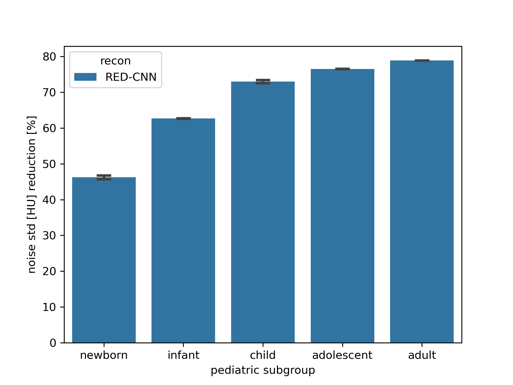

pediatricIQphantoms
===================

|zenodo| |docs| |tests|

**Digital Pediatric Image Quality Phantoms for Evaluating CT Denoising Methods** are a set of digital phantoms and simulation methods for generating CT images of standard image quality (IQ) phantoms designed to match the effective diameter of pediatric patients ranging from newborns to teenagers. This repository has `tools <make_phantoms.py>`_ for generating `MITA-LCD phantom <https://www.phantomlab.com/catphan-mita>`_ and a multi-contrast sensitometry module similar to the CTP404 module of the `Catphan 600 phantom <https://www.phantomlab.com/catphan-600>`_. Functions are also provided to simulate different acquisition parameters and CT scanner models.

.. image:: ped_dl_eval_tool.png
        :width: 800
        :align: center

.. |zenodo| image:: https://zenodo.org/badge/DOI/10.5281/zenodo.10064035.svg
    :alt: Zenodo Data Access
    :scale: 100%
    :target: https://zenodo.org/doi/10.5281/zenodo.10064035

.. |docs| image:: https://readthedocs.org/projects/docs/badge/?version=latest
    :alt: Documentation Status
    :scale: 100%
    :target: https://pediatriciqphantoms.readthedocs.io/en/latest/
.. |tests| image:: https://github.com/bnel1201/pediatricIQphantoms/actions/workflows/python-package-conda.yml/badge.svg?branch=main
    :alt: Package Build and Testing Status
    :scale: 100%
    :target: https://github.com/bnel1201/pediatricIQphantoms/actions/workflows/python-package-conda.yml

Features
--------

- The CTP404 contrast module phantom for assessing CT number accuracy and contrast-dependent spatial resolution
- CCT189 the MITA LCD phantom for assessing low contrast detectability
- Uniform water phantoms for assessing noise and noise texture

In addition, this repo contains examples of measurements using these digital image quality phantoms

- `phantom creation and simulation <demo_01_phantom_creation.sh>`_, including different scanner configurations and acquisition protocols
- examples of how to `view the dataset <https://github.com/bnel1201/pediatricIQphantoms/blob/main/notebooks/01_viewing_images.ipynb>`_ and `evaluate pediatric generalizability of denoisers <https://github.com/bnel1201/pediatricIQphantoms/blob/main/notebooks/02_pediatric_denoising_evaluation.ipynb>`_ are shown in the notebooks directory

Example from the `uniform phantom denoising performance assessment notebook <https://github.com/bnel1201/pediatricIQphantoms/blob/main/notebooks/02_pediatric_denoising_evaluation.ipynb>`_ demonstrating the pediatric subgroup denoising performance of a `RED-CNN <https://ieeexplore.ieee.org/document/7947200/>`_ image-based deep learning denoiser using the `pediatricIQphantoms dataset <https://zenodo.org/doi/10.5281/zenodo.10064035>`_ 

Start Here
----------

*Installation is only required to generate new datasets*, a pregenerated dataset can be downloaded from `Zenodo <https://zenodo.org/doi/10.5281/zenodo.10064035>`_, only proceed if you want to generate new simulated datasets.

.. _version requirements:

**Requirements** 

- `Conda <https://docs.conda.io/projects/conda/en/stable/user-guide/getting-started.html>`_ package manager e.g. `Miniconda <https://docs.anaconda.com/free/miniconda/>`_
- Mac, Linux, or `Windows Subsystem for Linux (WSL) <https://learn.microsoft.com/en-us/windows/wsl/install>`_ operating systems described on the `Octave Conda Forge page <https://anaconda.org/conda-forge/octave>`_. This package currently uses the Octave-based `Michigan Image Reconstruction Toolbox (MIRT) <https://github.com/JeffFessler/mirt>`_

.. _installation:

**Installation**

.. code-block:: shell

        git clone https://github.com/bnel1201/pediatricIQphantoms
        cd pediatricIQphantoms
        conda env create --file environment.yml
        conda activate pediatricIQphantoms

The code block above does the following in 4 lines:

1. Git clones the `pediatricIQphantoms <https://github.com/bnel1201/pediatricIQphantoms>`_ repository

2. Changes the active directory to the repo

3. Creates a new conda environment called "pediatricIQphantoms"

4. Activates the conda environment. This makes the phantom creation library `pediatricIQphantoms` accessible in scripts (see `examples <examples/running_simulations.ipynb>`_) and via command line calls (see `demos <demo_01_phantom_creation.sh>`_).

**Test the Installation**

.. code-block:: shell

        pytest

This runs the [unit tests](https://github.com/bnel1201/pediatricIQphantoms/tree/main/tests) to verify that installation was successful.

How to use this repo and the Pediatric IQ Phantoms
--------------------------------------------------

**pediatricIQphantoms** provides examples for how to use the pediatric IQ phantoms, (available to download and use directly from `Zenodo <https://zenodo.org/doi/10.5281/zenodo.10064035>`_) or generate new phantom instances using the provided `phantom generation functions <src/pediatricIQphantoms/make_phantoms.py>`_.

Several examples are provided on how to use these functions:

- Check out the :doc:`usage` section for detailed information on customizing dataset running_simulations.
- See the `tests directory <tests>`_ for simple script examples
- `Computational notebooks <https://github.com/bnel1201/pediatricIQphantoms/tree/main/notebooks>`_ have also been provided to demonstrate how to use `pediatricIQphantoms dataset <https://zenodo.org/doi/10.5281/zenodo.10064035>`_ including:

  - `options for viewing the dataset images <https://github.com/bnel1201/pediatricIQphantoms/blob/main/notebooks/view_images.ipynb>`_
  - `running CT simulations <https://github.com/bnel1201/pediatricIQphantoms/blob/main/notebooks/running_simulations.ipynb>`_
  - `using the dataset to assess denoising performance in pediatric subgroups <https://github.com/bnel1201/pediatricIQphantoms/blob/main/notebooks/uniform%20-%20denoising%20efficiency.ipynb>`_

Contribute
----------

`Issue Tracker <https://github.com/bnel1201/pediatricIQphantoms/issues>`_ | `Source Code <https://github.com/bnel1201/pediatricIQphantoms>`_ | 

Support
-------

If you are having issues, please let us know.
brandon.nelson@fda.hhs.gov; rongping.zeng@fda.hhs.gov

Disclaimer
----------

This software and documentation (the "Software") were developed at the Food and Drug Administration (FDA) by employees of the Federal Government in the course of their official duties. Pursuant to Title 17, Section 105 of the United States Code, this work is not subject to copyright protection and is in the public domain. Permission is hereby granted, free of charge, to any person obtaining a copy of the Software, to deal in the Software without restriction, including without limitation the rights to use, copy, modify, merge, publish, distribute, sublicense, or sell copies of the Software or derivatives, and to permit persons to whom the Software is furnished to do so. FDA assumes no responsibility whatsoever for use by other parties of the Software, its source code, documentation or compiled executables, and makes no guarantees, expressed or implied, about its quality, reliability, or any other characteristic. Further, use of this code in no way implies endorsement by the FDA or confers any advantage in regulatory decisions. Although this software can be redistributed and/or modified freely, we ask that any derivative works bear some notice that they are derived from it, and any modified versions bear some notice that they have been modified.

License
-------

The project is licensed under `Creative Commons Zero v1.0 Universal LICENSE`_.

Additional Resources
--------------------

- https://github.com/DIDSR/LCD_CT
