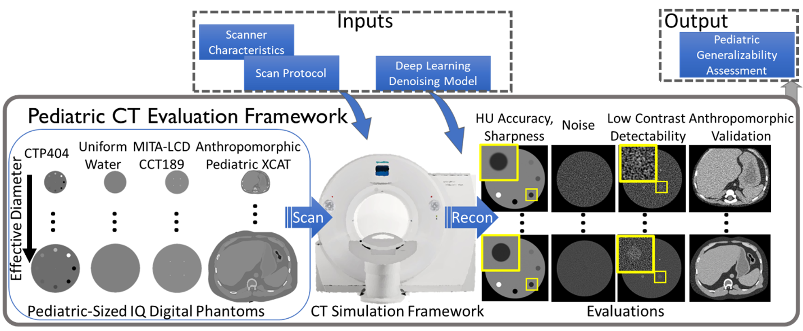

Welcome to pediatricIphantom documentation!
===========================================

This documentation provides information regarding how to download, install, and use the pediatricIQphantoms tools which are designed sim.

Introduction
------------

**Digital Pediatric Image Quality Phantoms for Evaluating CT Denoising Methods** are a set of digital phantoms and simulation methods for generating CT images of standard image quality (IQ) phantoms designed to match the effective diameter of pediatric patients ranging from newborns to teenagers. This repository has `tools <make_phantoms.py>`_ for generating `MITA-LCD phantom <https://www.phantomlab.com/catphan-mita>`_ and a multi-contrast sensitometry module similar to the CTP404 module of the `Catphan 600 phantom <link here>`_. Functions are also provided to simulate different acquisition parameters and CT scanner models.

Size is one of the most important patient factors influencing CT performance as it determines the overall x-ray attenuation and noise properties. New deep learning-based denoisers have shown potential to improve image quality for a fixed radiation dose or maintain image quality while reducing dose <cite>.  Performance Assessment consists of analytical quality assurance phantom models and interfaces to CT simulation frameworks to generate simulated CT images representing different diameters of each phantom.

Installation
------------

.. _version requirements:

**Requirements**

- Matlab (**version > R2016a**) *or* Octave (**version > 4.4**)
- If the above Matlab or Octave requirements are not met, then `conda <https://conda.io/projects/conda/en/latest/user-guide/install/index.html>`_ is required to install Octave (See step 2 below).

If required versions of Matlab or Octave are not available on your system (see how to get `matlab version <https://www.mathworks.com/help/matlab/ref/version.html>`_ or `octave version <https://docs.octave.org/v4.4.0/System-Information.html#XREFversion>`_) then see `installation`_ for how to setup an Octave environment to run LCD-CT.

1. Git clone the LCD-CT Toolbox repository:

.. code-block:: shell

    git clone https://github.com/bnel1201/pediatricIQphantoms
    cd pediatricIQphantoms

2. *If neither Matlab or Octave are installed or do not meet the **version requirements**, you can source `install.sh` to prepare a `conda <https://conda.io/projects/conda/en/latest/user-guide/install/index.html>`_ environment. Or run the following lines in your command prompt:

.. code-block:: shell

   conda create --name octave -y && conda activate octave
   conda install -c conda-forge octave -y

Note: this can take about 10-30 minutes to complete.

1. Test the installation

- From the bash command line:

.. code-block:: shell

   $ bash test.sh

Users
-----

Check out the :doc:`usage` section for further information.

Developers
----------

If you'd like to contribute to the code or documentation of this project, please check out our :doc:`contributing` page.

.. toctree::
   usage
   api
   contributing
   faq
   :maxdepth: 2
   :caption: Contents:

Indices and tables
==================

* :ref:`genindex`
* :ref:`search`
