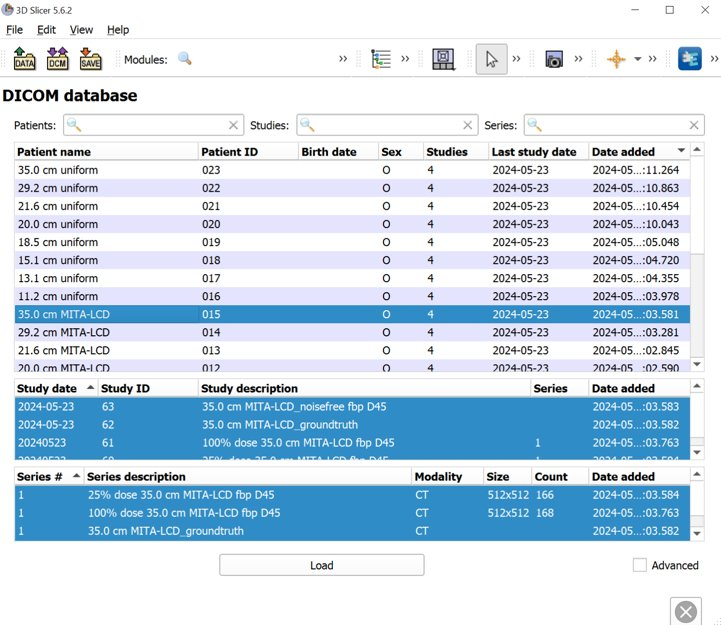
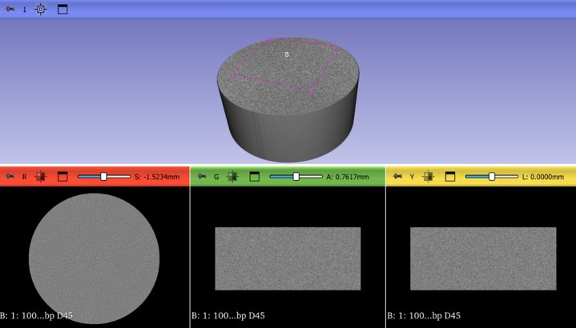

Usage
=====

Intended Purpose
----------------

The pediatricIQphantom phantom generation and CT simulation tool is intended for evaluating the patient size dependence of nonlinear, data-driven image denoising and processing algorithms by providing digital versions of standard image quality phantoms, the `MITA-LCD phantom <https://www.phantomlab.com/catphan-mita>`_ and CTP404 module of the `Catphan 600 phantom <https://www.phantomlab.com/catphan-600>`_. Evaluating the patient size dependence of denoising algorithms is important when considering the performance of these devices in pediatric populations[1]. This is due to the smaller fields of view (FOV) associated with pediatric protocols which alters the image texture, an important factor when training and testing data-drive denoising methods.

Intended users are CT device developers and  image denoising and processing software developers. Advanced nonlinear CT image reconstruction and denoising methods (products code JAK_, QIH_, LLZ_ among others) includes statistically iterative, model-based iterative and deep learning-based image reconstruction and denoising methods.

.. _JAK: https://www.accessdata.fda.gov/scripts/cdrh/cfdocs/cfPCD/classification.cfm?id=5631

.. _QIH: https://www.accessdata.fda.gov/scripts/cdrh/cfdocs/cfPCD/classification.cfm?id=5704

.. _LLZ: https://www.accessdata.fda.gov/scripts/cdrh/cfdocs/cfPCD/classification.cfm?id=5654

The LCD performance obtained using the LCD-CT tools can help the assessment of image quality imprvoment and quantitative dose reduction potential of advanced nonlinear CT image reconstruction and denoising methods with respect to a reference reconstruction option such as the FBP method. 

Examples
--------

The quickest and simplest way to start generating new datasets with different parameters is using the command line interface tool `make_phantoms`  and modifying the provided configuration toml files. The exampes below illustrate different scenarios that can be experimented with using the command line tool and config files.

- `example_01_multiple_recon_kernels.sh <https://github.com/bnel1201/pediatricIQphantoms/blob/main/demo_01_phantom_creation.sh>`_

The purpose of this example is to illustrate how to batch several simulations into a single config .toml file and how to update parameters while keeping everything else the same. This example is available in the `examples folder <https://github.com/bnel1201/pediatricIQphantoms/tree/main/examples>`_ or alternatively can be run using the following terminal command:

.. code-block:: shell

    python make_phantoms.py configs/multiple_recon_kernels.toml

The key difference in this config file compared to the `default <https://github.com/bnel1201/pediatricIQphantoms/blob/main/configs/defaults.toml>`_ or `test <https://github.com/bnel1201/pediatricIQphantoms/blob/main/configs/test.toml>`_ configs is that multiple simulations are batched in a single config file by repeating the **[[simulation]]** toml header for each new simulation to add to the batch. Note in toml this is referred to as a `nested table <https://toml.io/en/v1.0.0#array-of-tables>`_.

.. code-block:: toml

    [[simulation]]

    model = ['CCT189'] 
    diameter = [112, 131, 151, 185, 200, 292, 350] 

    ...

    fbp_kernel = 'hanning,2.05'

    [[simulation]]

    fbp_kernel = 'hanning,0.85'

    [[simulation]]

    model = ['CTP404']
    dose_level = [1.0]
    fbp_kernel = 'hanning,2.05'

    [[simulation]]

    fbp_kernel = 'hanning,0.85'
   ...

Here multiple simulations are run, note the repeated header blocks **[[simulation]]** indicate the start of a new experiment. Any parameters set in the first simulation, (the first **[[simulation]]** above), override the `default parameters <defaults.toml>`_. In each subsequent **[[simulation]]** an new provided settings will update the scan settings, otherwise all other parameters will carry over from the previous simulation.

For example:

.. code-block:: python

    {'image_directory': 'results/multiple_recon_kernels',
    'model': ['CCT189'],
    'diameter': [112, 131, 151, 185, 200, 292, 350],
    'reference_diameter': 200,
    'framework': 'MIRT',
    'nsims': 200,
    'nangles': 1160,
    'aec_on': True,
    'add_noise': True,
    'full_dose': 300000.0,
    'dose_level': [0.1, 0.25, 1.0],
    'sid': 595,
    'sdd': 1085.6,
    'nb': 880,
    'na': 1160,
    'ds': 1,
    'offset_s': 1.25,
    'fov': 340,
    'image_matrix_size': 512,
    'offset': 0,
    'fbp_kernel': 'hanning,2.05'}

In the second simulation in the config file only the `fbp_kernel` is updated 

.. code-block:: toml

    [[simulation]]

    fbp_kernel = 'hanning,0.85'

This results in only updating the `fbp_kernel` element leaving all other elements the same from the previous simulation.

.. code-block:: python

    {'image_directory': 'results/multiple_recon_kernels',
     'model': ['CCT189'],
     'diameter': [112, 131, 151, 185, 200, 292, 350],
     'reference_diameter': 200,
     'framework': 'MIRT',
     'nsims': 200,
     'nangles': 1160,
     'aec_on': True,
     'add_noise': True,
     'full_dose': 300000.0, 
     'dose_level': [0.1, 0.25, 1.0],
     'sid': 595,
     'sdd': 1085.6,
     'nb': 880,
     'na': 1160,
     'ds': 1,
     'offset_s': 1.25,
     'fov': 340,
     'image_matrix_size': 512,
     'offset': 0,
     **'fbp_kernel': 'hanning,0.85'**}

Then by third simulation a new phantom is introduced, CTP404, and we wish to only image it at full dose and with the first of the two kernels being investigated (sharp and smooth):

.. code-block:: toml

    [[simulation]]

    model = ['CTP404']
    dose_level = [1.0]
    fbp_kernel = 'hanning,2.05'

.. code-block:: python

    {'image_directory': 'results/multiple_recon_kernels',
     **'model': ['CTP404']**,
     'diameter': [112, 131, 151, 185, 200, 292, 350],
     'reference_diameter': 200,
     'framework': 'MIRT',
     'nsims': 10,
     'nangles': 1160,
     'aec_on': True,
     'add_noise': True,
     'full_dose': 3000000.0,
     **'dose_level': [1.0]**,
     'sid': 595,
     'sdd': 1085.6,
     'nb': 880,
     'na': 1160,
     'ds': 1,
     'offset_s': 1.25,
     'fov': 340,
     'image_matrix_size': 512,
     'offset': 0,
     'fbp_kernel': 'hanning,2.05'}

Finally by the fourth we repeat the previous simulation but with the second kernel, the smooth kernel

.. code-block:: toml

    [[simulation]]

    fbp_kernel = 'hanning,0.85'

.. code-block:: python

    {'image_directory': 'results/multiple_recon_kernels',
     **'model': ['CTP404']**,
     'diameter': [112, 131, 151, 185, 200, 292, 350],
     'reference_diameter': 200,
     'framework': 'MIRT',
     'nsims': 10,
     'nangles': 1160,
     'aec_on': True,
     'add_noise': True,
     'full_dose': 3000000.0,
     'dose_level': [1.0],
     'sid': 595,
     'sdd': 1085.6,
     'nb': 880,
     'na': 1160,
     'ds': 1,
     'offset_s': 1.25,
     'fov': 340,
     'image_matrix_size': 512,
     'offset': 0,
     **'fbp_kernel': 'hanning,0.85'**}

This is done in parsing the config files using the python `dict update method <https://docs.python.org/3/library/stdtypes.html?highlight=dict%20update#dict.update>`_ https://github.com/bnel1201/pediatricIQphantoms/blob/62a45930053502e8e9982af4b521fdd4eee314ed/make_phantoms.py#L56

- Reproducing the `pediatricIQphantoms dataset <https://zenodo.org/doi/10.5281/zenodo.10064035>`_

**warning:** this may take several hours to complete, but is recommended if you want to reproduce the `pediatricIQphantoms dataset <https://zenodo.org/doi/10.5281/zenodo.10064035>`_ with different scanner or phantom characteristics using the config file editing processes described in the previous example.

.. code-block:: shell

    make_phantoms configs/pediatricIQphantoms.toml

Note that this example of the executable `make_phantoms` that is installed and added to your python after installing the `pediatricIQphantoms <https://github.com/bnel1201/pediatricIQphantoms>`_ python package (see `install instructions <https://pediatriciqphantoms.readthedocs.io/en/latest/index.html>`_ for details)

Viewing images
--------------

The outputs of the simulation are `DICOM <https://en.wikipedia.org/wiki/DICOM>`_ CT images. The notebook `01_viewing_images.ipynb <https://github.com/bnel1201/pediatricIQphantoms/blob/main/notebooks/01_viewing_images.ipynb>`_ discusses ways to view and interact with DICOM images produced in `00_running_simulations.ipynb <https://github.com/bnel1201/pediatricIQphantoms/blob/main/notebooks/00_running_simulations.ipynb>`_

`run_batch_sim <https://pediatriciqphantoms.readthedocs.io/en/latest/api.html#pediatricIQphantoms.run_batch_sim>`_ outputs simulated datasets in the following directory structure:

.. code-block:: shell

    $ tree results/test -P *_000.dcm | head -n 15

        results/test
    ├── CCT189
    │   ├── diameter112mm
    │   │   ├── dose_025
    │   │   │   └── fbp hanning205
    │   │   │       └── 11.2 cm CCT189_000.dcm
    │   │   └── dose_100
    │   │       └── fbp hanning205
    │   │           └── 11.2 cm CCT189_000.dcm
    │   └── diameter292mm
    │       ├── dose_025
    │       │   └── fbp hanning205
    │       │       └── 29.2 cm CCT189_000.dcm
    │       └── dose_100
    │           └── fbp hanning205

CSV files are output with each batched simulation which include file path and all relevant acquisition parameters, for example:

.. csv-table:: Table Title
   :file: metadata.csv
   :header-rows: 1

**Drag and drop the unzipped dataset** into [3D Slicer](https://www.slicer.org/) to automatically load the dataset into [Slicer's DICOM database](https://slicer.readthedocs.io/en/latest/user_guide/modules/dicom.html)

Examples of other viewers:

1. `Radiant <https://www.radiantviewer.com/>`_` *Note*: this is a [freemium](https://en.wikipedia.org/wiki/Freemium) product
2. `SNAP ITK <http://www.itksnap.org/pmwiki/pmwiki.php?n=Main.HomePage>`_ Originally developed for 3D medical imaging segmentation
3. `Fiji/ImageJ <https://imagej.net/software/fiji/>`_ originally developed for 2D biomedical imaging analysis

Conclusions
-----------

This section introduced several ways to interact with pediatricIQphantom simulation tools and view the DICOM images produced by `run_batch_sim <https://pediatriciqphantoms.readthedocs.io/en/latest/api.html#pediatricIQphantoms.run_batch_sim>`_. 

**Next** see the notebooks for practical examples `00_running_simulations.ipynb <https://github.com/bnel1201/pediatricIQphantoms/blob/main/notebooks/00_running_simulations.ipynb>`_

References
----------

[1] Nelson B, Kc P, Badal-Soler A, Jiang L, Masters S, Zeng R. Pediatric-Specific Evaluations for Deep Learning CT Denoising. Published online July 3, 2023. doi:10.5281/zenodo.8111530
[2] Zeng R, Lin CY, Li Q, et al. Performance of a deep learning-based CT image denoising method: Generalizability over dose, reconstruction kernel, and slice thickness. Med Phys. 2022;49(2):836-853. doi:10.1002/mp.15430

